```mermaid
graph TD
    A["🚀 Start Pipeline"] --> B["📋 Data Validation<br/>Load & Validate Excel"]
    B --> C["🧹 Data Cleaning<br/>Remove Duplicates & Standardize"]
    C --> D["🔄 Data Transformation<br/>Feature Engineering"]
    D --> E["📊 Statistical Analysis<br/>Funnel & Channel Performance"]
    E --> F["📝 Report Generation<br/>Markdown + PDF"]
    F --> G["✅ Complete<br/>Executive Reports Ready"]
    
    B --> B1["validate structure<br/>check data quality"]
    C --> C1["clean strings<br/>standardize geography<br/>deduplicate records"]
    D --> D1["categorize job titles<br/>create funnel flags<br/>group channels"]
    E --> E1["analyze conversion rates<br/>perform regression<br/>generate insights"]
    F --> F1["create markdown<br/>generate PDF<br/>export data"]
    
    style A fill:#263238,color:#ffffff
    style B fill:#1b5e20,color:#ffffff
    style C fill:#e65100,color:#ffffff
    style D fill:#33691e,color:#ffffff
    style E fill:#0d47a1,color:#ffffff
    style F fill:#880e4f,color:#ffffff
    style G fill:#1b5e20,color:#ffffff
```

# 🚀 Marketing Report Generator - ABC Inc. Methodology

A complete marketing analysis system that generates professional executive reports through an automated pipeline of data processing, statistical analysis, and actionable insights generation.

## 📚 Case Study Foundation

This work is based on the **Analytics Case Study v2 4** and implements the methodology described in the document `data/Analytics Case Studyv2 4.pdf`. The analysis is performed on the dataset provided in `data/analytics-case-study-data-8.xlsx`, containing marketing funnel data and prospect information for comprehensive business intelligence.

## 📋 Table of Contents

- [Overview](#-overview)
- [System Architecture](#-system-architecture)
- [Workflow](#-workflow)
- [Project Structure](#-project-structure)
- [Best Practices Implemented](#-best-practices-implemented)
- [Installation and Setup](#-installation-and-setup)
- [System Usage](#-system-usage)
- [Detailed Modules](#-detailed-modules)
- [Generated Outputs](#-generated-outputs)
- [Performance Monitoring](#-performance-monitoring)
- [Troubleshooting](#-troubleshooting)

## 🎯 Overview

The **Marketing Report Generator** is an enterprise solution that completely automates the marketing data analysis process, from initial validation to executive PDF report generation. The system uses advanced data science techniques to identify optimization opportunities and generate data-driven strategic recommendations.

### ✨ Key Features

- **Automated Pipeline**: Complete processing without manual intervention
- **Advanced Statistical Analysis**: Logistic regression, hypothesis testing, and correlation analysis
- **Executive Reports**: Professional documents in Markdown and PDF formats
- **Performance Monitoring**: Detailed execution metrics
- **Modular Architecture**: Independent and reusable components
- **Code Standards**: camelCase, JSDoc, and private methods

## 🏗️ System Architecture

The system follows a **modular pipeline architecture** with 5 main stages:

```
📥 Raw Data → 🔍 Validation → 🧹 Cleaning → 🔄 Transformation → 📊 Analysis → 📝 Reports
```
#



#

### Main Components

| Module | Responsibility | Main File |
|--------|----------------|-----------|
| **Pipeline Orchestrator** | General coordination and monitoring | `main.py` |
| **Data Validator** | Data validation and loading | `validation.py` |
| **Data Cleaner** | Cleaning and preprocessing | `clean.py` |
| **Data Transformer** | Feature engineering | `transform.py` |
| **Data Analyzer** | Statistical analysis and insights | `analysis.py` |
| **Report Generator** | Report generation | `generate.py` |

## 🔄 Workflow

### Complete Flow Diagram

The system executes the following sequential steps:

1. **Initialization**: Pipeline configuration and parameter validation
2. **Data Validation**: Loading and structure verification
3. **Data Cleaning**: Preprocessing and standardization
4. **Transformation**: Feature creation and categorization
5. **Statistical Analysis**: Calculations and insights generation
6. **Report Generation**: Executive document creation

### Detailed Flow by Stage

#### 📋 Stage 1: Data Validation
- Loading Excel/CSV files
- Required column verification
- Data quality analysis
- Completeness score calculation
- Duplicate identification

#### 🧹 Stage 2: Data Cleaning
- Empty row removal
- String standardization
- Geographic normalization
- Prospect status validation
- Unique ID deduplication
- Timestamp processing

#### 🔄 Stage 3: Transformation
- Job title categorization
- Funnel flag creation
- Channel grouping
- Geographic region definition
- Seniority classification
- Value potential calculation

#### 📊 Stage 4: Analysis
- Funnel performance analysis
- Channel performance analysis
- Geographic analysis
- Job segmentation
- Logistic regression
- Statistical testing
- Insights generation
- Recommendations creation

#### 📝 Stage 5: Report Generation
- Template loading
- Executive summary generation
- Analytical sections creation
- Markdown formatting
- PDF conversion
- File export

## 📁 Project Structure

```
marketing-report-generator/
├── 📄 main.py                  # Main pipeline and orchestrator
├── 📄 validation.py            # Data validation module
├── 📄 clean.py                 # Data cleaning module
├── 📄 transform.py             # Transformation module
├── 📄 analysis.py              # Statistical analysis module
├── 📄 generate.py              # Report generation module
├── 📄 requirements.txt         # Project dependencies
├── 📄 README.md                # Main documentation
├── 📁 data/                    # Input data and templates
│   ├── analytics-case-study-data-8.xlsx
│   ├── Analytics Case Studyv2 4.pdf
│   └── SKELETON.md
├── 📁 generated/               # Generated outputs
│   ├── clean_analytics-case-study-data-8.csv    # Clean data
│   ├── ABC_Inc._Latest_Report.md                 # Markdown report
│   └── ABC_Inc._Latest_Report.pdf                # PDF report
└── 📁 extra/                   # Additional presentation materials
    └── ABC-Inc-Marketing-Analysis-Report-Slide-Deck.pdf  # Executive slide deck (created separately)
```

## 🎨 Best Practices Implemented

### **Code Standards**
- **camelCase naming convention** for functions and variables
- **Modular architecture** with separation of concerns
- **Comprehensive error handling** throughout the pipeline
- **Performance monitoring** with detailed execution metrics
- **Type hints** for better code documentation

## 🛠️ Installation and Setup

### Prerequisites

- Python 3.8+
- pip (package manager)

### Installation

1. **Clone the repository**:
```bash
git clone <repository-url>
cd marketing-report-generator
```

2. **Install dependencies**:
```bash
pip install -r requirements.txt
```

3. **Verify file exists**:
```bash
ls data/analytics-case-study-data-8.xlsx
```

### Main Dependencies

```txt
pandas>=1.5.0          # Data manipulation
numpy>=1.21.0          # Numerical computing
openpyxl>=3.0.0        # Excel reading
scikit-learn>=1.1.0    # Machine Learning
scipy>=1.9.0           # Statistical analysis
matplotlib>=3.5.0      # Visualizations
seaborn>=0.11.0        # Statistical plots
reportlab>=3.6.0       # PDF generation
```

## 🚀 System Usage

### Execution

```bash
# Run the marketing analysis pipeline
python3 main.py

# Company: ABC Inc.
# Objective: Maximize Free-Trial Registrations
```


### Expected Output

```
╔══════════════════════════════════════════════════════════════════════════════╗
║              🚀 MARKETING REPORT GENERATOR - ABC INC.                        ║
╠══════════════════════════════════════════════════════════════════════════════╣
║ 📁 Data Source: data/analytics-case-study-data-8.xlsx                        ║
║ 🏢 Company: ABC Inc.                                                         ║
║ 🎯 Objective: Increase Lead Conversion Rate                                  ║
║ ⏰ Started: 2024-01-15 14:30:25                                              ║
╚══════════════════════════════════════════════════════════════════════════════╝

┌─────────────────────────────────────────────────────────────────────────────┐
│                          📋 STEP 1: DATA VALIDATION                         │
└─────────────────────────────────────────────────────────────────────────────┘
✅ Excel data loaded successfully: 1,000 records
✅ Data validation completed successfully (0.15s)

┌─────────────────────────────────────────────────────────────────────────────┐
│                           🧹 STEP 2: DATA CLEANING                          │
└─────────────────────────────────────────────────────────────────────────────┘
✅ Data cleaning completed successfully (0.23s)

┌─────────────────────────────────────────────────────────────────────────────┐
│                        🔄 STEP 3: DATA TRANSFORMATION                       │
└─────────────────────────────────────────────────────────────────────────────┘
✅ Data transformation completed successfully (0.18s)

┌─────────────────────────────────────────────────────────────────────────────┐
│                          📊 STEP 4: DATA ANALYSIS                           │
└─────────────────────────────────────────────────────────────────────────────┘
✅ Data analysis completed successfully (1.45s)

┌─────────────────────────────────────────────────────────────────────────────┐
│                        📝 STEP 5: REPORT GENERATION                         │
└─────────────────────────────────────────────────────────────────────────────┘
✅ Report generation completed successfully (0.67s)

╔══════════════════════════════════════════════════════════════════════════════╗
║                      🎉 PIPELINE COMPLETED SUCCESSFULLY!                     ║
╚══════════════════════════════════════════════════════════════════════════════╝

📄 Markdown Report: generated/ABC_Inc._Latest_Report.md
📋 PDF Report: generated/ABC_Inc._Latest_Report.pdf

┌─── ⏱️  PERFORMANCE METRICS ────────────────────────────────────────────────┐
│ Total execution time: 2.68s                                                │
│ Validation: 0.15s (5.6%)                                                   │
│ Cleaning: 0.23s (8.6%)                                                     │
│ Transformation: 0.18s (6.7%)                                               │
│ Analysis: 1.45s (54.1%)                                                    │
│ Generation: 0.67s (25.0%)                                                  │
└────────────────────────────────────────────────────────────────────────────┘

┌─── 📊 KEY BUSINESS METRICS ────────────────────────────────────────────────┐
│ Total prospects analyzed: 997                                              │
│ Overall conversion rate: 12.74%                                            │
│ Target conversions: 127                                                    │
│ Best performing channel: Referral (25.0%)                                  │
│ High priority recommendations: 2                                           │
│ Medium priority recommendations: 3                                         │
│ Total actionable recommendations: 8                                        │
└────────────────────────────────────────────────────────────────────────────┘

┌─────────────────────────────────────────────────────────────────────────────┐
│ ✨ Analysis complete at 2024-01-15 14:30:28                                 │
│ 🚀 Insights ready for strategic decision-making!                            │
└─────────────────────────────────────────────────────────────────────────────┘
```

## 📚 Detailed Modules

### 🔍 DataValidator (`validation.py`)

**Responsibility**: Initial data validation and loading

**Main Methods**:
- `loadData()`: Loads Excel/CSV files
- `validateStructure()`: Validates column structure
- `validateDataQuality()`: Analyzes data quality
- `printValidationReport()`: Displays detailed report

**Generated Metrics**:
- Quality score (0-100)
- Completeness percentage
- Duplicate count
- Data type analysis

### 🧹 DataCleaner (`clean.py`)

**Responsibility**: Data cleaning and preprocessing

**Main Methods**:
- `cleanData()`: Main cleaning pipeline
- `_removeEmptyRows()`: Removes empty rows
- `_cleanStringColumns()`: Standardizes strings
- `_standardizeGeography()`: Normalizes countries to ISO-3 codes
- `_deduplicateRecords()`: Removes duplicates using timestamp priority

**Critical Data Normalization**:
- **Country Standardization**: Converts all country names to ISO-3 codes (USA, GBR, DEU, etc.)
- **Deduplication Rule**: When duplicate Prospect IDs exist, keepsclear the record with the most recent timestamp
- **Geographic Consistency**: Eliminates free-text country variations for reliable analysis

**Operations Performed**:
- Extra space removal and text normalization
- Geographic standardization to ISO-3 format
- Status validation and categorization
- Smart ID deduplication with timestamp priority
- Timestamp processing and flag creation

### 🔄 DataTransformer (`transform.py`)

**Responsibility**: Feature engineering and transformations

**Main Methods**:
- `transformData()`: Main pipeline
- `_categorizeJobTitles()`: Categorizes job titles
- `_createFunnelFlags()`: Creates funnel flags
- `_createChannelGroups()`: Groups channels
- `_createGeographicRegions()`: Defines regions

**Created Features**:
- Seniority level (Junior/Mid/Senior)
- Job category (Executive/Decision Maker/Practitioner)
- Conversion flags (isRegistered, isAttended, isConverted)
- Engagement score (0-5)
- Value potential (1-5)

### 📊 DataAnalyzer (`analysis.py`)

**Responsibility**: Statistical analysis and insights generation

**Main Methods**:
- `performCompleteAnalysis()`: Complete analysis
- `analyzeFunnelPerformance()`: Funnel analysis
- `analyzeChannelPerformance()`: Channel performance
- `analyzeGeographicPerformance()`: Geographic analysis
- `_performLogisticRegression()`: Predictive modeling

**Analyses Performed**:
- Conversion rates by funnel stage
- Marketing channel performance
- Geographic conversion distribution
- Job/seniority segmentation
- Logistic regression for prediction
- Statistical hypothesis testing

### 📝 ReportGenerator (`generate.py`)

**Responsibility**: Executive report generation

**Main Methods**:
- `generateCompleteReport()`: Generates complete report
- `_generateExecutiveSummary()`: Executive summary
- `_generateAnalysisSection()`: Analytical sections
- `_generateRecommendationsSection()`: Recommendations
- `_generatePDFReport()`: PDF conversion

**Generated Outputs**:
- Structured Markdown report
- Professional executive PDF
- Charts and visualizations
- Metrics tables
- Prioritized recommendations list

## 📄 Generated Outputs

### 1. **Markdown Report** (`*_Latest_Report.md`)

Structured document containing:
- **Executive Summary**: Key metrics and insights
- **Quality Analysis**: Processed data status
- **Funnel Performance**: Detailed conversion analysis
- **Channel Analysis**: Marketing channel efficiency
- **Segmentation**: Geographic and job analysis
- **Recommendations**: Prioritized action list
- **Technical Metrics**: Processing details

### 2. **PDF Report** (`*_Latest_Report.pdf`)

Executive version formatted for presentations:
- Professional layout
- Charts and visualizations
- Formatted tables
- Key metrics summary
- Highlighted recommendations

### 3. **Clean Data** (`clean_*.csv`)

CSV file with processed data:
- Deduplicated records
- Standardized fields
- Engineered features
- Ready for additional analysis


## ⚡ Performance Monitoring

### Execution Metrics

The system automatically monitors:
- **Total execution time**
- **Time per stage** (validation, cleaning, transformation, analysis, generation)
- **Percentage of time per stage**
- **Record throughput** (records/second)

### Implemented Optimizations

1. **Vectorized Processing**: Using pandas for batch operations
2. **Lazy Loading**: On-demand data loading
3. **Memory Management**: Intermediate variable cleanup
4. **Caching**: Reuse of expensive calculations

### Typical Benchmarks

For 1,000 records:
- **Validation**: 0.1-0.2s
- **Cleaning**: 0.2-0.3s  
- **Transformation**: 0.1-0.2s
- **Analysis**: 1.0-2.0s
- **Generation**: 0.5-1.0s
- **Total**: 2-4s

## 📄 License

This project is open source and available under the MIT License.

---

## 📊 Statistical Validation

### **Confidence Intervals & Hypothesis Testing**

The system implements rigorous statistical validation:

| **Metric** | **Method** | **Confidence Level** | **Significance Threshold** |
|------------|------------|---------------------|---------------------------|
| Conversion Rates | Binomial CI | 95% | p < 0.05 |
| Channel Performance | Chi-square test | 95% | p < 0.05 |
| Geographic Analysis | Proportion test | 95% | p < 0.05 |
| Logistic Regression | Wald test | 95% | p < 0.05 |

### **Sample Statistical Results**

**Channel Performance Regression Coefficients:**
```
Channel: Referral
- Coefficient: 0.847
- Std Error: 0.198
- p-value: < 0.001
- 95% CI: [0.459, 1.235]

Channel: Advertisement  
- Coefficient: 0.012
- Std Error: 0.089
- p-value: 0.893
- 95% CI: [-0.162, 0.186]
```

**Geographic Performance (Top Countries):**
```
USA: 11.8% ± 1.9% (95% CI: [9.9%, 13.7%])
CAN: 15.0% ± 3.6% (95% CI: [11.4%, 18.6%])
CHN: 20.0% ± 5.7% (95% CI: [14.3%, 25.7%])
```

All reported metrics include confidence intervals and statistical significance testing to ensure reliability of business recommendations.

---

## 👨‍💻 Author

**Guilherme Cagide Fialho**

Professional with 5 years of experience in software development and 2 years specializing in data technologies. Currently working as a Data Engineer at IPNET Growth Partner, with expertise in Google Cloud Platform (GCP), Python, BigQuery, Dataflow, and Data Lake/Warehouse management. 

Experience includes leading governmental data projects, developing internal automation systems, and implementing large-scale ETL processes for international LATAM clients. Passionate about using technology to discover insights that drive innovation and business growth.

---

**Marketing Report Generator v1.0** - Transforming data into strategic decisions 🚀 